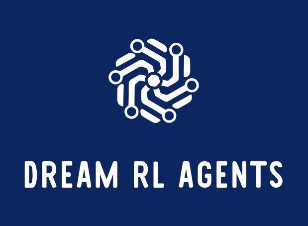

## What is Dream RL Agents?
- An open source library for deep reinforcement learning agents
- Code and articles written to be easy to understand and learn from
- "Solves" OpenAI's gym environments in example files
- Not meant for production, may contain subtle bugs. Use stable-baselines instead https://github.com/hill-a/stable-baselines

## Agents

The following agents have been implemented and documented:
- DDPG - Deep Deterministic Policy Gradients
- PPO & REINFORCE - Proximal Policy Gradients (REINFORCE implemented as a precursor to PPO)
- DQN - Deep Q Learning including Double Q Learning, Dueling Networks and Prioritized Experience Replay

### Deep Deterministic Policy Gradients agent

#### A trained LunarLander agent


#### Documentation

[Go to article about Deep Deterministic Policy Gradients](/Documentation/DDPG.md)

#### How to use

````
# Externals
import gym

# Internals
from Agents.DDPG import DDPGAgent
from Agents.Common import AgentConfig
from Agents.Common import Runner

# Create an agent that solves the environment:
# - LunarLanderContinuous-v2 defines "solving" as getting average reward of 200 over 100 consecutive trials."
env = gym.make("LunarLanderContinuous-v2")

# Create the agent
config = AgentConfig(
    env=env,
    seed=42,
    target_average=200, 
    n_episodes=500, 
    batch_norm=False, 
    batch_size=64, 
    gamma=0.98, 
    actor_learning_rate=1e-4,
    critic_learning_rate=1e-3,
    weight_decay=0,
    update_every=1,
    ou_noise_sigma=0.01,
    fc1_units=400,
    fc2_units=300,
    per_active=False)

agent = DDPGAgent(env, config)

# Create a runner that runs the agent in the environment
runner = Runner(agent)

# Run the agent
score = runner.run_agent()

# Visualize the score
score.visualize()

# Close
env.close()
````

### Proximal Policy Optimization agent

#### A trained Pong agent


#### Documentation

[Go to article about Proximal Policy Gradients](/Documentation/PPO.md)

#### How to use

````
# Externals
import gym

# Internals
from Agents.PPO import PPOAgent
from Agents.Common import AgentConfig
from Agents.Common import Runner
from Agents.Utils.parallelEnv import parallelEnv

# Create an agent that solves the environment:
envs = parallelEnv("PongDeterministic-v4", n=8, seed=1234)

# Create the agent
config = AgentConfig(
    parallelEnv=envs, 
    n_episodes=1500, 
    learning_rate=1e-4,
    fc1_units=256,
    ACTION_0=4,
    ACTION_1=5,
    max_t=500)

agent = PPOAgent(config)

# Create a runner that runs the agent in the environment
runner = Runner(agent)

# Run the agent
score = runner.run_parallel_trajectories()

# Visualize the score
score.visualize()

# Close
env.close()
````

### Deep Q Learning agent

#### A trained CartPole agent


#### Documentation

[Go to article about Deep Q Learning](/Documentation/DQN.md)

#### How to use

````
import gym
from Agents.Common import Runner
from Agents.DQN import DQNAgent
from Agents.Common import AgentConfig
from Agents.Common import Runner

# Make the gym
env = gym.make("CartPole-v1")

# Create an agent that solves the environment:
# - CartPole-v1 defines "solving" as getting average reward of 475.0 over 100 consecutive trials."
config = AgentConfig(
    env=env,
    n_episodes=1000, 
    target_average=475,
    update_every=1,
    batch_size=64,
    gamma=0.95,
    learning_rate=1e-4,
    deepq_double_learning=True,
    deepq_dueling_networks=True,
    per_active=True)
agent = DQNAgent(env, config)

# Create a runner that runs the agent in the environment
runner = Runner(agent, save_best_score='Checkpoints/cardpole_v1_dqn.ch')

# Run the agent
score = runner.run_agent()

# Visualize the score
score.visualize()

env.close()
````
